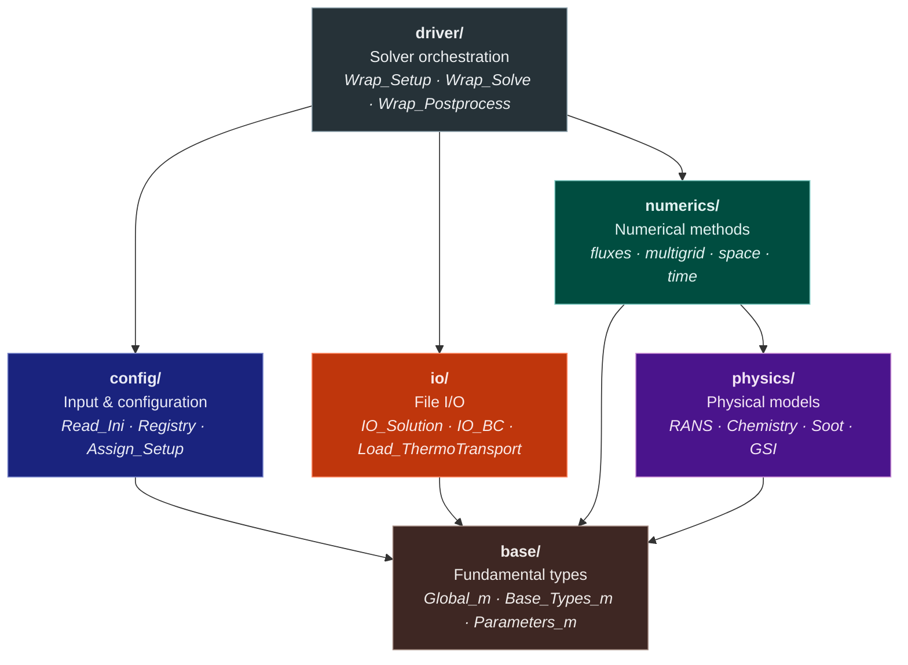
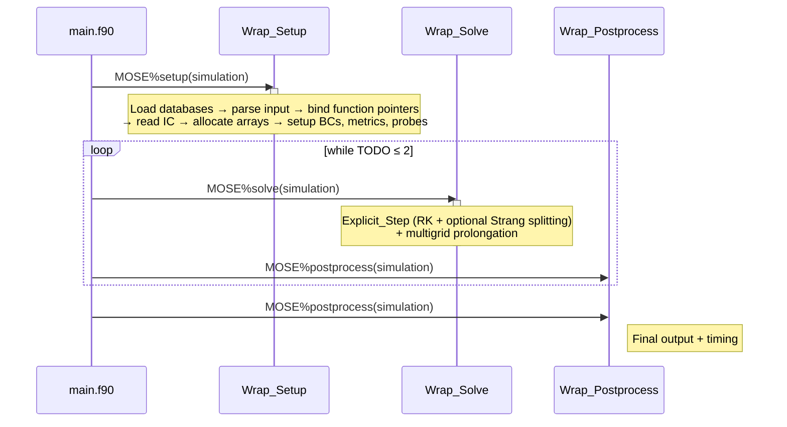

# Code Structure

This page documents the repository layout, the internal architecture
of the MOSE library, and the solver execution pipeline.

---

## Repository Layout

```
MOSE/
├── CMakeLists.txt          # Top-level CMake build
├── CMakePresets.json        # Developer presets (compilers, paths)
├── install.sh               # Build / compile / update helper
├── mkdocs.yml               # Documentation site configuration
│
├── src/
│   ├── app/                 # Executables
│   │   ├── main.f90         # MOSE solver entry point
│   │   └── docgen.f90       # Input-parameter documentation generator
│   └── lib/                 # MOSE library (libMOSEL)
│       ├── base/            # Fundamental types and global parameters
│       ├── config/          # Input parsing, registry, setup assignment
│       ├── diagnostic/      # Residual monitoring
│       ├── driver/          # High-level solver orchestration
│       ├── io/              # File I/O (solution, BCs, probes, walls)
│       ├── numerics/        # Numerical methods
│       │   ├── fluxes/      #   Riemann solvers, convective/diffusive flux
│       │   ├── multigrid/   #   Restriction / prolongation
│       │   ├── space/       #   Metrics, reconstruction, limiters, ghosts
│       │   └── time/        #   Time stepping (RK, IRS, Strang, newstate)
│       ├── parallel/        # MPI / OpenMP communication helpers
│       └── physics/         # Physical models
│           ├── turbulence/  #   RANS models (SA, SST, Wilcox, QCR, SSGLRR)
│           ├── Lib_Chemistry.f90
│           ├── Lib_GSI.f90  #   Gas-surface interactions
│           ├── Lib_RotatingFrame.f90
│           └── Lib_Soot.f90
│
├── lib/                     # External dependencies (git submodules)
│   ├── FLINT/               # Thermochemistry library
│   ├── ORION/               # Structured-grid I/O library
│   └── third_party/
│       ├── FiNeR/           # INI file parser
│       └── ExactPack/       # Exact Riemann solver (Python, for V&V)
│
├── test/                    # Validation test suite
│   ├── 1D/                  # 1-D shock tube cases
│   ├── 2D/                  # 2-D steady and unsteady cases
│   ├── 3D/                  # 3-D cases
│   ├── Pressure_Centrifugal_eq/  # Rotating-frame equilibrium cases
│   └── common/              # Shared thermodynamic databases
│
├── docs/                    # MkDocs documentation source
├── cmake/                   # CMake modules (flags, OpenMP, etc.)
├── bin/                     # Built executables (MOSE, DocGen)
└── build/                   # Build artefacts
```

---

## Dependencies

**Required submodules** (always linked, located in `lib/`):

| Library | Purpose |
|---------|---------|
| `FLINT` | Thermochemistry (internally depends on `OSLO` ODE solvers) |
| `ORION` | Structured multi-block grid I/O |
| `FiNeR` | INI file parser |

Optional compile-time dependencies are enabled via CMake flags; see [Key CMake options](#key-cmake-options) in the Build System section.
`ExactPack` (Python) is used only for V&V post-processing and is never linked at compile time.

---

## Library Architecture

The MOSE library (`libMOSEL`) is organised in six layers.  Lower
layers have no knowledge of higher layers.



---

## Solver Pipeline

The main program (`src/app/main.f90`) creates a `MOSE_type` object
and calls three phases: **setup**, **solve** (in a loop), and
**postprocess**.



### Explicit Step

Each call to `Explicit_Step` performs one complete time step:

1. **Compute Δt** — local and global time steps from CFL and von Neumann conditions.
2. **Strang splitting** (if `N_strang = 2`) — wrap the RK stages with two half-step chemistry
   integrations: RK(½Δt) → chemistry ODE(Δt) → RK(½Δt).
3. **Runge–Kutta loop** (repeated `n_RK` times per step):
    - Fill ghost cells (boundary and inter-block conditions)
    - Evaluate convective fluxes (reconstruction → Riemann solver)
    - Evaluate diffusive fluxes
    - Apply boundary fluxes
    - Add RANS source terms (if a turbulence model is active)
    - Add soot source terms (if the soot model is active)
    - Update conserved state via `RK_Newstate` (IRS smoothing + RK update)
4. **Compute residual** and write diagnostics.

---

## Convective Flux Evaluation

The convective flux at each cell interface is computed in five stages
from a 4-point stencil:

1. **Shock detection** — Jameson sensor flags cells near discontinuities.
2. **MUSCL reconstruction** — extrapolation to the interface using one of 7 flux limiters.
3. **Interface states** — left and right primitive-variable states at the face.
4. **Riemann solver** — one of 14 selectable solvers resolves the jump.
5. **Numerical flux** — result multiplied by the interface area vector F · A.

---

## RANS Turbulence Models

At run time `Assign_Setup` reads `turbulence_model` from the input file
and binds the selected implementation to four procedure pointers in `Mod_RANS`:
`Eddy_Viscosity`, `RANS_Diffusive_Flux`, `Stress_Vector`, and `RANS_Set_Wall_Values`.

| Key | Implementation | Description |
|-----|---------------|-------------|
| `SA` | `Lib_Spalart` | Baseline Spalart–Allmaras |
| `SAcomp` | `Lib_Spalart` | + compressibility correction |
| `SAR` | `Lib_Spalart` | + rotation correction |
| `SA-RC` | `Lib_SpalartShur` | Rotation–curvature (Shur) correction |
| `SST` | `Lib_SST` | Menter k-ω SST |
| `Wilcox2006` | `Lib_Wilcox2006` | Wilcox k-ω (2006 revision) |
| `SSGLRR` | `Lib_SSGLRR` | Speziale–Sarkar–Gatski RSM |
| `QCR2000` | `Lib_QCR2000` | Quasi-curvilinear correction |

---

## Data Structures

The top-level type `MOSE_simulation_type` holds an array of grid levels
(one per multigrid level) and an I/O container:

```
MOSE_simulation_type
├── domain(:)   MOSE_domain_type    — one entry per multigrid level
│   ├── blk(:)  MOSE_block_type     — one entry per structured block
│   │   ├── P(:,:,:,:)  real64      — primitive variables
│   │   ├── C(:,:,:,:)  real64      — conservative variables
│   │   ├── R(:,:,:,:)  real64      — residual (flux accumulator)
│   │   └── dtlocal(:,:,:)  real64  — local time step
│   ├── nb      integer             — number of blocks
│   ├── iter    integer             — iteration counter
│   ├── time    real64              — physical time
│   └── dtglobal real64            — global time step
└── IOfield(:)  IOfield_type        — I/O metadata
```

| Array | Shape | Content |
|-------|-------|---------|
| `P` | `(nprim, ni, nj, nk)` | Primitive variables |
| `C` | `(ncons, ni, nj, nk)` | Conservative variables |
| `R` | `(ncons, ni, nj, nk)` | Residual (flux accumulator) |
| `dtlocal` | `(ni, nj, nk)` | Local time step per cell |

---

## Build System

### CMake targets

| Target | Type | Description |
|--------|------|-------------|
| `MOSEL` | Static library | Core solver + all physics/numerics; links FLINT, ORION, FiNeR |
| `MOSE` | Executable | Standalone solver (`src/app/main.f90`) |
| `DocGen` | Executable | Input-parameter docs generator (`src/app/docgen.f90`) |

### Build workflow

```bash
# Option A: install.sh (recommended for first build)
./install.sh build --compilers=gnu

# Option B: CMake presets (for iterative development)
./install.sh compile          # uses CMakePresets.json
# or equivalently:
cmake --preset default && cmake --build build
```

### Key CMake options

| Option | Default | Library | Effect |
|--------|:-------:|---------|--------|
| `USE_OPENMP` | OFF | OpenMP | Enable shared-memory threading |
| `USE_MPI` | OFF | MPI | Enable distributed-memory parallelism |
| `USE_SUNDIALS` | OFF | SUNDIALS | Alternative ODE solvers for chemistry |
| `USE_CANTERA` | OFF | Cantera | Alternative chemistry backend |
| `USE_TECIO` | OFF | TecIO | Enable Tecplot binary output |
| `BASIC_TEST` | OFF | — | Build unit tests in `src/test/` |

### Dependency paths

External library paths are set via CMake cache variables or the
`install.sh --include-*` flags:

| Variable | Default | Library |
|----------|---------|---------|
| `ORION_PATH` | `lib/ORION/` | ORION I/O |
| `FLINT_PATH` | `lib/FLINT/` | FLINT thermochemistry |
| `OSLO_PATH` | `lib/FLINT/lib/OSLO/` | OSLO ODE solvers |
| `FINER_PATH` | `lib/third_party/FiNeR/` | FiNeR INI parser |

---

## Naming Conventions

| Convention | Example | Meaning |
|------------|---------|---------|
| `MOSE_` prefix | `MOSE_Global_m` | Public Fortran module |
| `obj_` prefix | `obj_sim_param` | Global configuration singleton |
| `Lib_` prefix | `Lib_SST` | Computational routine library |
| `Mod_` prefix | `Mod_Riemann` | Module with types + pointers |
| `Wrap_` prefix | `Wrap_Solve` | Driver-level wrapper |
| `_m` suffix | `Config_Types_m` | Fundamental type module |
| `_type` suffix | `MOSE_block_type` | Derived type |
