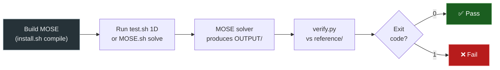

# Testing

MOSE ships with a validation test suite that exercises the solver on
canonical problems with known analytical or reference solutions.  This
page describes the test organisation, how to run tests, and how to add
new cases.

---

## Test Organisation

```
test/
├── 1D/                        # 1-D shock tube validation cases
│   ├── Sod79/
│   ├── Tor99/
│   ├── Ein91/
│   └── Noh87/
├── 2D/                        # 2-D validation cases
│   ├── euler/                 # Inviscid cases
│   │   ├── oblique-shock/
│   │   ├── prandtl-meyer/
│   │   ├── ramp-channel/
│   │   ├── hypersonic-cylinder/
│   │   ├── chang-nozzle/
│   │   ├── rocket-nozzle/     # Subdirs: frozen/ equilibrium/ finite-rate/
│   │   └── supersonic-forward-step/
│   └── viscous/               # Viscous cases
│       ├── flat-plate-laminar/
│       ├── flat-plate-turbulent/
│       ├── Flat_Plate_SGGLRR/
│       └── swbli/
├── 3D/                        # 3-D validation cases
│   └── coriolis-channel/
├── Pressure_Centrifugal_eq/   # Rotating-frame equilibrium case
└── common/                    # Shared thermodynamic databases
    ├── Air/                   # 5-species air (dimensional)
    └── nondim-Air/            # 5-species air (non-dimensional)
```

### Categories

| Category | Location | What is checked |
|----------|----------|-----------------|
| **1-D shock tubes** | `test/1D/` | Density, velocity, pressure profiles against exact solutions (ExactPack) |
| **2-D inviscid** | `test/2D/euler/` | Converged Euler flow fields against reference data |
| **2-D viscous** | `test/2D/viscous/` | Converged Navier–Stokes / RANS solutions against reference data |
| **3-D** | `test/3D/` | 3-D flow cases |
| **Rotating frame** | `test/Pressure_Centrifugal_eq/` | Centrifugal equilibrium in a rotating reference frame |
| **Common** | `test/common/` | Shared thermodynamic databases used by multiple cases |

---

## Test Case Structure

Each test case is a self-contained directory:

```
test/1D/Sod79/
├── input.ini          # Solver input file
├── INPUT/             # Initial-condition files
├── MESH/              # Grid files
├── reference/         # Reference solution data
├── verify.py          # Comparison script (exit 0 = pass, exit 1 = fail)
└── MOSE.sh            # Run script
```

The key components are:

| File / Dir | Purpose |
|------------|---------|
| `input.ini` | Solver configuration (Riemann solver, CFL, output, ...) |
| `MESH/` | Pre-generated structured grid |
| `INPUT/` | Initial-condition field (ORION format) |
| `reference/` | Reference solution data |
| `verify.py` | Python script that compares solver output against the reference and returns exit code 0 (pass) or 1 (fail) |
| `MOSE.sh` | Convenience script to compile, run, or kill the solver |

---

## Running Tests

### 1-D test suite

The `test.sh` script automates the 1-D validation cases.  Run it from
the `test/` directory:

```bash
cd test

# Run all 1-D cases sequentially
./test.sh 1D

# Run all 1-D cases in parallel (splits idle cores across cases)
./test.sh -p 1D

# Clean all test output
./test.sh clean
```

Results are appended to `test/testlog.txt`:

```
MOSE TEST SESSION
Fri Mar 14 10:30:00 CET 2026

Test case: 1D

success - Sod79/
success - Tor99/
success - Ein91/
success - Noh87/
```

### Single test case

2-D and 3-D cases are run individually from their own directory:

```bash
cd test/2D/euler/oblique-shock

# Compile a local MOSE binary
./MOSE.sh compile

# Run the solver
./MOSE.sh solve

# Run with OpenMP (4 threads)
./MOSE.sh -p 4 solve

# Run in background
./MOSE.sh -b solve

# Verify against reference
python3 -B verify.py
```

---

## Test Workflow Diagram



---

## Adding a New Test Case

### 1-D shock tube

1. Create a directory under `test/1D/` (e.g. `test/1D/MyCase/`).
2. Provide `input.ini`, `MESH/`, and `INPUT/` with the problem setup.
3. Run the solver to generate a reference solution.
4. Save the reference data in `reference/` and write a `verify.py` that:
    - Reads the solver output
    - Reads the reference data
    - Compares key quantities (density, velocity, pressure) within tolerance
    - Calls `sys.exit(0)` on success, `sys.exit(1)` on failure
5. Copy `MOSE.sh` from an existing case (it is generic).

### 2-D / 3-D case

Same structure. Place the directory under the appropriate folder in
`test/2D/euler/`, `test/2D/viscous/`, or `test/3D/`.  Multi-chemistry
cases (e.g. `rocket-nozzle`) may use subdirectories for each chemistry
level (`frozen/`, `equilibrium/`, `finite-rate/`) with a shared
`verify.py` at the parent level.

---

## Common Thermodynamic Data

The `test/common/` directory contains shared species databases:

| Directory | Content |
|-----------|---------|
| `Air/` | 5-species air (N₂, O₂, NO, N, O) with dimensional transport |
| `nondim-Air/` | Same mixture in non-dimensional form |

Test cases symlink to these files rather than duplicating them.

---

## Reference Solution Generation

The 1-D reference solutions are generated using
[ExactPack](https://github.com/lanl/ExactPack) (included in
`lib/third_party/ExactPack/`), which provides exact Riemann-problem
solvers for canonical test cases (Sod, Toro, Einfeldt, Noh, etc.).

The `verify.py` scripts use ExactPack to compute the exact solution
on the same grid and compare point-by-point.
