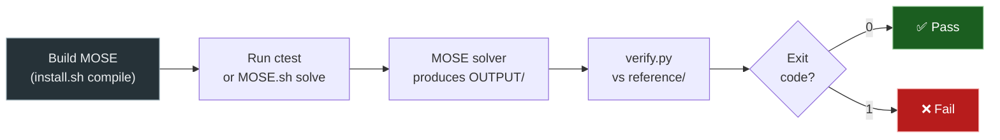

# Testing

MOSE ships with a validation test suite that exercises the solver on
canonical problems with known analytical or reference solutions.  This
page describes the test organisation, how to run tests, and how to add
new cases.

---

## Test Organisation

```
test/
├── 1D/                        # 1-D shock tube validation cases
│   ├── Sod79/
│   ├── Tor99/
│   ├── Ein91/
│   ├── Noh87/
│   └── Shu-Osher/             # Mach-3 shock / sine-wave interaction
├── fast/                      # Fast pre-push tests (hard-invariant checks)
│   ├── riemann-smoke/         # Every shock-capturing solver stays positive
│   ├── numerics-smoke/        # Limiter / time-scheme / recon / int-var sweep
│   ├── conservation/          # Closed slip-wall box conserves mass
│   ├── openmp-equiv/          # 1 vs 4 threads bit-identical
│   └── restart/               # Restart round-trip reproduces uninterrupted run
├── 2D/                        # 2-D validation cases
│   ├── euler/                 # Inviscid cases
│   │   ├── oblique-shock/
│   │   ├── prandtl-meyer/
│   │   ├── ramp-channel/
│   │   ├── hypersonic-cylinder/
│   │   ├── chang-nozzle/
│   │   ├── rocket-nozzle/     # Subdirs: frozen/ equilibrium/ finite-rate/
│   │   └── supersonic-forward-step/
│   └── viscous/               # Viscous cases
│       ├── flat-plate-laminar/
│       ├── flat-plate-turbulent/
│       ├── Flat_Plate_SGGLRR/
│       └── swbli/
├── 3D/                        # 3-D validation cases
│   └── coriolis-channel/
├── Pressure_Centrifugal_eq/   # Rotating-frame equilibrium case
└── common/                    # Shared thermodynamic databases
    ├── Air/                   # 5-species air (dimensional)
    └── nondim-Air/            # 5-species air (non-dimensional)
```

### Categories

| Category | Location | What is checked |
|----------|----------|-----------------|
| **1-D shock tubes** | `test/1D/` | Density, velocity, pressure profiles against exact solutions (ExactPack) |
| **2-D inviscid** | `test/2D/euler/` | Converged Euler flow fields against reference data |
| **2-D viscous** | `test/2D/viscous/` | Converged Navier–Stokes / RANS solutions against reference data |
| **3-D** | `test/3D/` | 3-D flow cases |
| **Rotating frame** | `test/Pressure_Centrifugal_eq/` | Centrifugal equilibrium in a rotating reference frame |
| **Common** | `test/common/` | Shared thermodynamic databases used by multiple cases |

---

## Test Case Structure

Each test case is a self-contained directory:

```
test/1D/Sod79/
├── input.ini          # Solver input file
├── INPUT/             # Initial-condition files
├── MESH/              # Grid files
├── reference/         # Reference solution data
├── verify.py          # Comparison script (exit 0 = pass, exit 1 = fail)
└── MOSE.sh            # Run script
```

The key components are:

| File / Dir | Purpose |
|------------|---------|
| `input.ini` | Solver configuration (Riemann solver, CFL, output, ...) |
| `MESH/` | Pre-generated structured grid |
| `INPUT/` | Initial-condition field (ORION format) |
| `reference/` | Reference solution data |
| `verify.py` | Python script that compares solver output against the reference and returns exit code 0 (pass) or 1 (fail) |
| `MOSE.sh` | Convenience script to compile, run, or kill the solver |

---

## Running Tests

The validation cases are driven by **CTest** (see
[Automated Test Tiers](#automated-test-tiers-ctest--ci) below for the full
picture).  The quickest checks:

```bash
cd build

# The whole suite wired into CTest
ctest

# Just the fast pre-push tier (a few tens of seconds)
ctest -L fast

# A single case, with live output
ctest -R Sod79 -V
```

Individual cases can also be run directly from their own directory, which
is handy when iterating on a single problem.

### Single test case

2-D and 3-D cases are run individually from their own directory:

```bash
cd test/2D/euler/oblique-shock

# Compile a local MOSE binary
./MOSE.sh compile

# Run the solver
./MOSE.sh solve

# Run with OpenMP (4 threads)
./MOSE.sh -p 4 solve

# Run in background
./MOSE.sh -b solve

# Verify against reference
python3 -B verify.py
```

---

## Automated Test Tiers (CTest & CI)

The most important cases are wired into **CTest** so they can run
unattended in a Git pre-push hook and in GitHub CI.  Tiers are expressed
through CTest **labels**
(defined in [`test/CMakeLists.txt`](https://github.com/open-hydra/MOSE/blob/main/test/CMakeLists.txt)):

| Label | Meaning |
|-------|---------|
| `fast` | Tiny, dependency-free, a few seconds each — run by the pre-push hook |
| `validation` | Analytic or reference comparison |
| `numerics` / `implementation` | Coverage area (numerical scheme vs. plumbing) |
| `needs-cantera` / `needs-sundials` / `needs-mpi` | Requires the matching optional dependency; excluded from the minimal CI build |

Run a tier from the build directory:

```bash
cd build

# Everything wired into CTest
ctest

# Just the fast pre-push tier
ctest -L fast

# Everything except heavy-dependency cases (what PR CI runs)
ctest --label-exclude "needs-cantera|needs-sundials|needs-mpi"
```

### Where each tier runs

| Tier | Trigger | Selector |
|------|---------|----------|
| **Fast** | `git push` (pre-push hook, [`.githooks/pre-push`](https://github.com/open-hydra/MOSE/blob/main/.githooks/pre-push)) | `ctest -L fast` |
| **PR CI** | pull request to `main` ([`ctest.yml`](https://github.com/open-hydra/MOSE/blob/main/.github/workflows/ctest.yml)) | `ctest --label-exclude "needs-*"` |
| **Nightly / dispatch** | scheduled / manual | full suite with Cantera + Sundials + MPI |

The CI build is deliberately minimal (`USE_MPI=OFF`, `USE_TECIO=OFF`,
`USE_SUNDIALS=OFF`, `USE_CANTERA=OFF`), so finite-rate chemistry,
equilibrium, MPI and binary-Tecplot cases cannot run there — they live in
the nightly tier.

To enable the pre-push hook locally:

```bash
git config core.hooksPath .githooks
```

### Fast tier contents

The fast suite asserts **hard invariants** (positivity, conservation,
bit-for-bit reproducibility) on tiny meshes — no digitized references, no
plotting, no optional dependencies — so it stays green in a few tens of
seconds on a CI runner.

| Test | Asserts | Reuses |
|------|---------|--------|
| `Sod79` | shock/contact positions, positivity | `test/1D/Sod79` |
| `Einfeldt91`, `Noh87`, `Toro99` | profiles vs ExactPack | `test/1D/{Ein91,Noh87,Tor99}` |
| `ShuOsher` | coarse (N=200) L1 density error vs an N=1600 reference | `test/1D/Shu-Osher` |
| `PrandtlMeyer` | analytic turning angle | `test/2D/euler/prandtl-meyer` |
| `RiemannSmoke` | every shock-capturing solver stays positive (no NaN, ρ,p>0) | `test/fast/riemann-smoke` |
| `NumericsSmoke` | all limiters × time schemes × recon × integration vars stay positive | `test/fast/numerics-smoke` |
| `Conservation` | closed slip-wall box conserves total mass to round-off | `test/fast/conservation` |
| `OpenMPEquiv` | 1 vs 4 threads bit-identical | `test/fast/openmp-equiv` |
| `Restart` | split + restart reproduces the uninterrupted run | `test/fast/restart` |

A few heavier checks carry the `validation` (not `fast`) label because they
need reference data or plotting — for example `ShuOsherConvergence`, a 4-grid
Shu–Osher Richardson study (N=200/400/800/1600) that estimates a grid-independent
solution by Richardson extrapolation, asserts a sane observed order and monotone
L1 convergence against it, and regenerates the V&V figure. Run them with
`ctest -L validation`.

The broader plan — coverage map, remaining gaps, and the rationale behind
the tiering — lives in
[`test/TESTING-PLAN.md`](https://github.com/open-hydra/MOSE/blob/main/test/TESTING-PLAN.md).

---

## Test Workflow Diagram


```mermaid
flowchart LR
    Build["Build MOSE<br/>(install.sh compile)"] --> Run["Run ctest<br/>or MOSE.sh solve"]
    Run --> Solve["MOSE solver<br/>produces OUTPUT/"]
    Solve --> Compare["verify.py<br/>vs reference/"]
    Compare --> Pass{"Exit<br/>code?"}
    Pass -->|0| OK["✅ Pass"]
    Pass -->|1| Fail["❌ Fail"]

    style Build fill:#263238,stroke:#90a4ae,color:#eceff1
    style OK fill:#1b5e20,stroke:#a5d6a7,color:#fff
    style Fail fill:#b71c1c,stroke:#ef9a9a,color:#fff
```

---

## Adding a New Test Case

### 1-D shock tube

1. Create a directory under `test/1D/` (e.g. `test/1D/MyCase/`).
2. Provide `input.ini`, `MESH/`, and `INPUT/` with the problem setup.
3. Run the solver to generate a reference solution.
4. Save the reference data in `reference/` and write a `verify.py` that:
    - Reads the solver output
    - Reads the reference data
    - Compares key quantities (density, velocity, pressure) within tolerance
    - Calls `sys.exit(0)` on success, `sys.exit(1)` on failure
5. Copy `MOSE.sh` from an existing case (it is generic).

### 2-D / 3-D case

Same structure. Place the directory under the appropriate folder in
`test/2D/euler/`, `test/2D/viscous/`, or `test/3D/`.  Multi-chemistry
cases (e.g. `rocket-nozzle`) may use subdirectories for each chemistry
level (`frozen/`, `equilibrium/`, `finite-rate/`) with a shared
`verify.py` at the parent level.

### Wiring a case into CTest

A case is only run by the pre-push hook and CI once it is registered in
[`test/CMakeLists.txt`](https://github.com/open-hydra/MOSE/blob/main/test/CMakeLists.txt).
Two helpers are available:

```cmake
# A case with a run command + a Python verifier (exit 0/1)
mose_add_test(NAME MyCase DIR 1D/MyCase
              RUN "./MOSE.sh solve" VERIFY verify.py
              LABELS "fast;validation;1D")

# A self-contained fast test driven by its own run.sh
mose_add_fast_script(MySmoke fast/my-smoke "fast;numerics;1D")
```

Add the `fast` label only if the case runs in a few seconds on a tiny mesh
and asserts a hard invariant — anything needing Cantera, Sundials or MPI
must instead carry the matching `needs-*` label so it is excluded from the
minimal CI build.

---

## Common Thermodynamic Data

The `test/common/` directory contains shared species databases:

| Directory | Content |
|-----------|---------|
| `Air/` | 5-species air (N₂, O₂, NO, N, O) with dimensional transport |
| `nondim-Air/` | Same mixture in non-dimensional form |

Test cases symlink to these files rather than duplicating them.

---

## Reference Solution Generation

The 1-D reference solutions are generated using
[ExactPack](https://github.com/lanl/ExactPack) (included in
`lib/third_party/ExactPack/`), which provides exact Riemann-problem
solvers for canonical test cases (Sod, Toro, Einfeldt, Noh, etc.).

The `verify.py` scripts use ExactPack to compute the exact solution
on the same grid and compare point-by-point.
